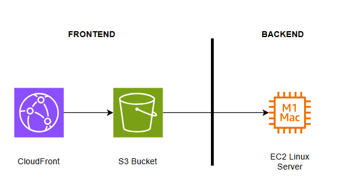
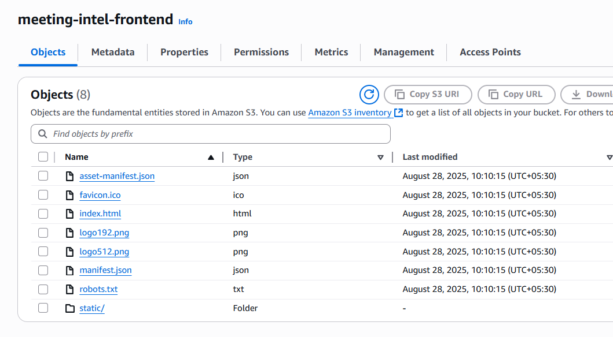

# AI-Powered Meeting Insights

This project is an end-to-end Retrieval-Augmented Generation (RAG) application using **FastAPI**, **ChromaDB**, and **ReactJS**. 

## Overall Working:

Feature 1: Upload
User uploads the video/audio files using the GUI. File is stored in from local disk. This is picked and transcribed by Whisper.cpp to text file. Metadata and text is stored in sqlite table. Now, the transcribed text in chuncked and embedded to Chromadb using SentenceTransformer.

Feature 2: Getting Insights/RAG<br>>
The second GUI block lists all the stored transcriptions by Title. User selects the title and Ask the query. Upon submission, the question is embedded using SentenceTransformer. The embedded question is searched against the chromadb collections retrieving the related chunks(Context).
Both the Question and Context is passed to Ollama, which gives back the response.

## Code repository

https://github.com/vsenathipathi/ai-meeting-intelligence

## Architecture


Backend: FastAPI, ChromaDB, boto3
Frontend: ReactJS
Embeddings & LLM: Amazon Bedrock
Vector DB: ChromaDB (persistent mode)


## Frontend Setup
Framework: ReactJS, Tailwind
Code Exposure: AWS S3
WAF: Cloudfront

I compiled the frontend. Pushed to the AWS S3 bucket. Exposed the index.html directly as static website (later added Cloudfront WAF)


Cloudfront WAF(for https)

Challenges and Solutions:
- ReactJS is new to me, took time to understand the framework.
- I used same AWS server for frontend too. Later deployed to S3 bucket for easy access
- Frontend is without any authentication. AWS Cognito can be used to add login authentication.

## Backend Setup
API: FastAPI, Sqlite
Infra: AWS EC2
Embeddings:ChromaDB
LLM: Ollama(gemma:2b), SentenceTransformer

I used FastAPI to create the backend. Exposed the API using EC2 instance. The EC2 endpoint is hardcoded in Frontend. 
Ran below 
nohup uvicorn main:app --host 0.0.0.0 --port 8000 > app.log 2>&1 &

Challenges and Solutions:
- At this point, backend endpoint is open, It should be secured using API key or JWT tokens.
- Embeddings failed due to low memory of the server. Had to provision costlier infra for this demo
- Persistent embeddings were not showing up. had to work on new chromadb client.
- Full backend can be containerized and moved to Docker as standardization.
- As a serverless approach, this framework(FastAPI,sqlite,ollama, chroma) can be moved to AWS lambda to reduce Infra cost.

## AI/ML pipeline implementation
- Store transcripts (by title) → split into chunks.
- Generate embeddings with SentenceTransformer.
- Save embeddings in ChromaDB.
- User asks a question → embed with SentenceTransformer.
- Search ChromaDB → get relevant chunks (context).
- Send question + context to Ollama.
- Display response + sources in UI.

The current pipeline architecture is custom, needs heavy-lifting. We can use simple options like AWS Bedrock + Knowledge Base, where everything is taken care by AWS.

- Store transcripts in S3.
- Configure Bedrock Knowledge Base → handles chunking + embeddings automatically.
- User asks a question → call Bedrock RetrieveAndGenerate API.
- Bedrock retrieves context + sends to chosen LLM (Claude, Llama, etc.).
- Response returned with citations.
- Display answer + sources in UI.

## Error handling
- Basic error handling in place (try-except blocks).
- User-friendly error messages for Frontend.
- Logging for debugging

## Documentation
NA


## 🚀 Features
- Document ingestion with embeddings (Amazon Bedrock `titan-embed-text-v2`)
- Vector database powered by ChromaDB
- Query API with FastAPI
- React frontend for interactive querying
- Source documents displayed along with AI-generated answers


---

## ⚙️ Setup Instructions

### 1. Clone the Repository
```bash
git clone https://github.com/<your-username>/my-ai-app.git
cd my-ai-app
